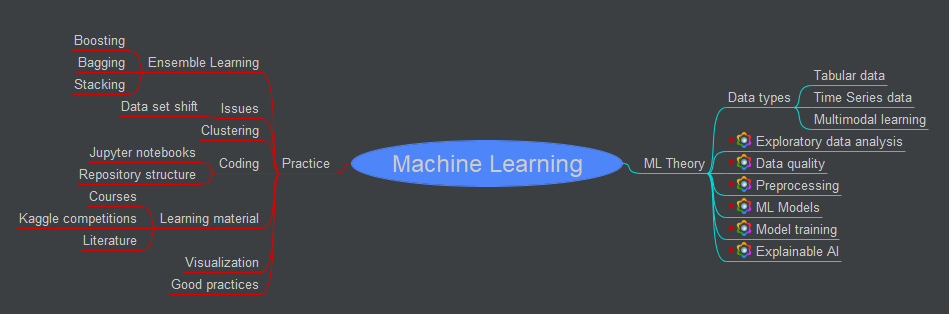
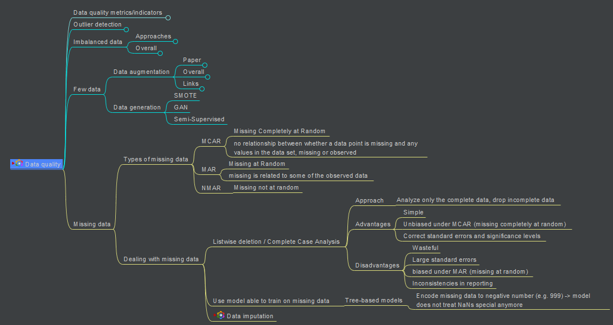
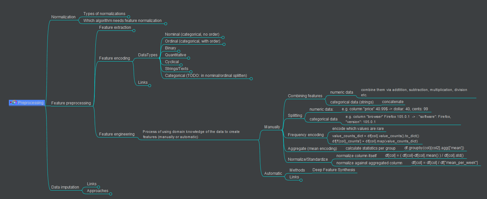

# machine-learning-knowledge-base
Mindmaps covering the topics:
* Exploratory data analysis (EDA)
* Data quality
* Preprocessing
* ML models
* Model training
* Explainable AI
* Practical tips

Use Freeplane ([https://docs.freeplane.org/](https://docs.freeplane.org/)) to view.

## Examples

